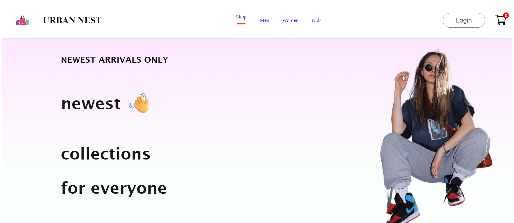

Urban Nest is a dummy e-commerce project designed to showcase my capabilities as a developer. The website offers a diverse selection of products for men, women, and kids, providing a seamless and intuitive shopping experience. Users can explore various categories, add items to their cart, and proceed with secure payment processing. This project demonstrates my proficiency in frontend and backend development, including dynamic content loading, state management, and integration with payment gateways. Urban Nest is a testament to my skills in creating functional and user-friendly e-commerce platforms.
